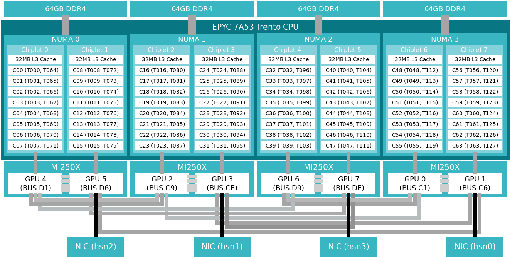

# Investigation of Setonix GPU Access Patterns
- This repo is created to explore the optimal way to use Setonix GPUs for YandaSoft kernels.

## Contents
- [Introduction](#Introduction)
- [Codes](#Codes)
    - [Hello World](#hello-world)
    - [Hello World as a Class](#hello-world-as-a-class)
    - [Deconvolution](#deconvolution)
- [Running Non-Exclusive Jobs](#running-non-exclusive-jobs)
    - [Single Thread](#single-thread)
    - [Single-Thread](#single-thread)
    - [Multi-Thread](#multi-thread)

## Introduction
- A Setonix GPU node has 
    - A 64-core **AMD Trento CPU**
    - 4 **AMD MI250X GPUs**
- Each **MI250X** contains 2 Graphics Complex Die (GCD)
- 64 cores on each GPU node is divided into 8-core groups called ***chiplets*** (or ***slurm-socket***)
- Cores in each chiplet share an L3 cache
- Each chiplet is physically connected to a specific GPU as shown below:

- To reach the optimal performance, it is critical for each chiplet to use the GPU, to which it's physically connected.
- 2 techniques can be used to do this:
    - use a wrapper that selects the correct GPU
    - generate an ordered list to be used in the --cpu-bind option

## Codes
### Hello World
- This code is a slightly modified version of the code used in [Setonix GPU Partition Quick Start](https://pawsey.atlassian.net/wiki/spaces/US/pages/51928618/Setonix+GPU+Partition+Quick+Start), and the original repository can be accessed [here](https://github.com/PawseySC/hello_jobstep). 
- The following modifications have been implemented:
    - ***printf***s are transformed into ***std::cout***s
        - (to make it more C++ish)
    - ***CMake*** is utilised as the cross-compiler
- The steps in the example given in Pawsey Supercomputing Centre's [running GPU jobs on Setonix](https://pawsey.atlassian.net/wiki/spaces/US/pages/51929056/Example+Slurm+Batch+Scripts+for+Setonix+on+GPU+Compute+Nodes) is pursued for the modified code here.
    - The latest version of ROCM, ROCM 5.4.3, is used instead of the default one, along with CMake 3.21
    - ***PrgEnv-gnu*** should be used, since ***PrgEnv-cray*** is not compatible with ***rocm/5.4.3***

### Hello World as a Class
- A new class "***Hello***", which includes the ***Hello World*** program in the previous section, has been constructed to be used in the following codes.
- Each GPU code will call this class at the beginning to make sure that it's using the correct GPU-chiplet pair.

### Deconvolution
- A simple deconvolution code with two clean solvers (1 for CPU & 1 for GPU) is included.
- A performance analysis is presented in the following sections.


## Running Non-Exclusive Jobs
### Single-thread
- First, jobs were built to work as non-exclusive to reproduce the results in the tutorial
- The following is the first case with a single node, single thread, 3 tasks and 3 GPUs
```
salloc -N 1 -n 3 -c 8 --sockets-per-node=3 --gpus-per-node=3 -A <myGpuProject>-gpu --partition=gpu-dev --time=00:30:00

module load PrgEnv-gnu craype-accel-amd-gfx90a rocm/5.4.3 cmake/3.21.4
export PATH=$PATH:${CRAY_MPICH_DIR}/bin
export CPATH=$CPATH:${CRAY_MPICH_DIR}/include
export LD_LIBRARY_PATH=$LD_LIBRARY_PATH:${CRAY_MPICH_DIR}/lib/
export MPICH_GPU_SUPPORT_ENABLED=1

cmake ../
make

CPU_BIND=$(generate_CPU_BIND.sh map_cpu)
echo $CPU_BIND

export OMP_NUM_THREADS=1
srun -N 1 -n 3 -c 8 --cpu-bind=${CPU_BIND} ../selectGPU_X.sh ./hello | sort -n
```
#### Result
```
```
### Multi-thread
- The following is the first case with a single node, multi-thread, multi-GPU
```
salloc -N 1 -n 3 -c 8 --sockets-per-node=3 --gpus-per-node=3 -A <myGpuProject>-gpu --partition=gpu-dev --time=00:30:00

module load PrgEnv-gnu craype-accel-amd-gfx90a rocm/5.4.3 cmake/3.21.4
export PATH=$PATH:${CRAY_MPICH_DIR}/bin
export CPATH=$CPATH:${CRAY_MPICH_DIR}/include
export LD_LIBRARY_PATH=$LD_LIBRARY_PATH:${CRAY_MPICH_DIR}/lib/
export MPICH_GPU_SUPPORT_ENABLED=1

cmake ../
make

CPU_BIND=$(generate_CPU_BIND.sh mask_cpu)
echo $CPU_BIND

export OMP_NUM_THREADS=4
srun -N 1 -n 3 -c 8 --cpu-bind=${CPU_BIND} ../selectGPU_X.sh ./hello | sort -n
```
#### Result
```
```


