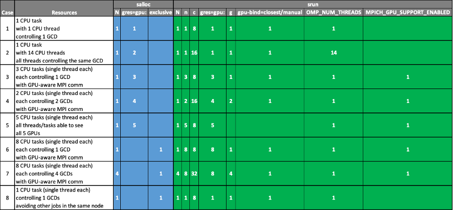

# Investigation of Setonix GPU Access Patterns
- This repo is created to explore the optimal way to use Setonix GPUs for YandaSoft kernels.

## Contents
- [Introduction](#Introduction)
    - [General Information about Setonix](#general-information-about-setonix)
    - [Filesystems & data management](#filesystems--data-management)
    - [About slurm partitions](#about-slurm-partitions)
    - [Node architecture](#node-architecture)
- [Job Allocation on Setonix](#job-allocation-on-setonix)
    - [Requesting allocation-packs](#requesting-allocation-packs)
    - [Account name](#account-name)
    - [Job allocation (salloc) options](#job-allocation-salloc-options)
    - [Job run (srun) options](#job-run-srun-options)
    - [Examples](#examples)
- [Optimal binding of GPUs](#optimal-binding-of-gpus)
    - [Using srun parameters](#using-srun-parameters)
    - [The manual method](#the-manual-method)
- [Testing Our Codes](#testing-our-codes)
    - [Hello World](#hello-world)
    - [Hello World as a Class](#hello-world-as-a-class)
    - [Clean](#clean)
    - [Simple Tests](#simple-tests)

## Introduction
### General information about Setonix
- AMD CPUs & GPUs
- HPE Cray EX architecture
- More than 200,000 CPUs
- 750 GPUs
- Slingshot-10 interconnect with 200Gb/s bandwidth per connection
- AMD infinity fabric interconnect
    - between GPUs
    - between CPUs and GPUs
- 192 GPU-enabled nodes
    - one 64-core AMD Trento CPU
    - 4 AMD MI250X GPU cards providing 8 logical GPUs per node
    - each MI250X GPU has 2 GCDs (Global Compute Dies)

### Filesystems & data management
- ***/home***: where user can save personal configuration files
- ***/software***: where user can install software
- ***/scratch***: high-performance parallel filesystem to be used for I/O operations within jobs

### About slurm partitions

|Partition|Number of Nodes|Number of cores per node|Memory (GB)|Number of GPUs per node|Max Allocation time (hr)| Purpose |
|:-:|:-:|:-:|:-:|:-:|:-:|:-:|
|gpu|134|64|230|8|24|gpu-based production jobs|
|gpu-highmem|38|64|460|8|24|gpu jobs requiring more memory|
|gpu-dev|20|64|230|8|4|gpu software development & debugging|

### Node architecture
- A Setonix GPU node has 
    - A 64-core **AMD Trento CPU**
    - 4 **AMD MI250X GPUs**
- Each **MI250X** contains 2 Graphics Complex Die (GCD)
    - Hence, each GPU node has 8 visible GPUs
- 64 cores of a single AMD CPU chip on each GPU node is divided into 8-core groups called ***chiplets*** (or ***slurm-socket***)
- Cores in each chiplet share an L3 cache
- Each chiplet is physically connected to a specific GPU by a direct Infinity Fabric connection as shown below:

- In order to achieve best performance, it is preferred that allocated CPU cores from a chiplet ***talk*** directly to the physically connected GPU
- The numbering of the cores and bus IDs of the GPUs may be used to identify the connected chiplets and GPUs.
- Communication with other GPUs is possible and fast, but requires at least another leap of communication.

- ***NOTE:***
    - The shared jobs are currently non-optimal (Shared jobs may not receive optimal binding)
    - Use exclusive jobs

## Job Allocation on Setonix
### Requesting ***allocation-packs***
- **--gres-gpu:** ***number*** is used to request an ***allocation-pack***
- An ***allocation-pack*** includes the following:
    - A CPU chiplet (a slurm-socket with 8 CPU cores)
    - 29.44 GB memory (1 / 8 of the total available RAM)
    - 1 GCD directly connected to that chiplet

### ***account*** name
- ***-gpu*** should be added at the end of the account name
    - e.g., salloc ... -A myAccount-gpu
    - This applies for all partitions mentioned above

### Job allocation (***salloc***) options:
|options|description|notes|
|-:|:-|-:|
|--nodes (-N)|number of nodes||
|--gres=gpu:*number*|number of allocation-packs per node||
|--exclusive|all the resources from the number of requested nodes|When this option is used, there is no need for the use of --gres=gpu:*number* during allocation|
|||Other slurm request parameters related to partition, walltime, job naming, output, email, etc can also be used|

### Job run (***srun***) options:
- The following should be provided, and not assumed to get inherited from ***salloc*** stage

|options|description|notes|
|-:|:-|-:|
|--nodes (-N)|number of nodes to be used by srun||
|--ntasks (-n)|total number of tasks to be spawned by the srun step|By default, tasks are spawned evenly across the number of allocated nodes|
|--cpus-per-task (-c)|should be set to multiples of 8 (whole chiplets)|Number of OpenMP threads can be controlled with OMP_NUM_THREADS environment variable|
|--gres=gpu:*number*| number of ***GPUs per node*** to be used by the srun step||
|--gpus-per-task| number of GPUs to be binded to each task spawned by the srun step via the -n option||
|--gpu-bind=closest| the chosen GPUs to be binded to the physically closest chiplet assigned to each task|does NOT work in some cases; use manual method instead|

### Examples
- 8 example cases with the needed salloc and srun options are summarised below:


## Optimal binding of GPUs
- There are 2 methods for optimal binding of a GPU to a CPU chiplet.
    - Using ***srun*** commands
    - Manual binding

### Using ***srun*** parameters
- Use the following flags:
    - --gpus-per-task
    - --gpu-bind=closest
- May cause MPI communication errors

### The ***manual*** method
- This method consist of two auxiliary techniques working together.
- **Technique 1:** Use a wrapper to set a unique value of ROCR_VISIBLE_DEVICE for each task.
    - Create the wrapper script, ***selectGPU_X.sh***, and use ***chmod*** to have execution permissions as shown below: 
    
    ```
    #!/bin/bash
 
    export ROCR_VISIBLE_DEVICES=$SLURM_LOCALID
    exec $*
    ```   
    ```
    chmod 755 selectGPU_X.sh    
    ```
- The wrapper should be called before the executable.
- **Technique 2:** Use a list of CPU cores to control task placement using ***generate_CPU_BIND.sh***
- ***generate_CPU_BIND.sh*** takes one of the parameters below:
    - ***map_cpu:*** To create an ordered list of CPU-cores
    - ***mask_cpu:*** To use an optimal communication between the tasks and GPUs
- Hence, our codes will be executed as follows:
    - For a single thread per task application:
    ```
    export OMP_NUM_THREADS=1
    CPU_BIND=$(generate_CPU_BIND.sh map_cpu)
    srun <srun flags> --cpu-bind=${CPU_BIND} ./selectGPU_X.sh ./myExec
    ```
    - For a multi thread per task application:
    ```
    export MPICH_GPU_SUPPORT_ENABLED = 1
    export OMP_NUM_THREADS=4
    CPU_BIND=$(generate_CPU_BIND.sh mask_cpu)
    srun <srun flags> --cpu-bind=${CPU_BIND} ./selectGPU_X.sh ./myExec
    ```

## Testing Our Codes
### Hello World
- This code is a slightly modified version of the code used in [Setonix GPU Partition Quick Start](https://pawsey.atlassian.net/wiki/spaces/US/pages/51928618/Setonix+GPU+Partition+Quick+Start), and the original repository can be accessed [here](https://github.com/PawseySC/hello_jobstep). 
- The following modifications have been implemented:
    - ***printf***s are transformed into ***std::cout***s
        - (to make it more C++ish)
    - ***CMake*** is utilised as the cross-compiler
- The steps in the example given in Pawsey Supercomputing Centre's [running GPU jobs on Setonix](https://pawsey.atlassian.net/wiki/spaces/US/pages/51929056/Example+Slurm+Batch+Scripts+for+Setonix+on+GPU+Compute+Nodes) is pursued for the modified code here.
    - The latest version of ROCM, ROCM 5.4.3, is used instead of the default one, along with CMake 3.21
    - ***PrgEnv-gnu*** should be used, since ***PrgEnv-cray*** is not compatible with ***rocm/5.4.3***

### Hello World as a Class
- A new class "***Hello***", which includes the ***Hello World*** program in the previous section, has been constructed to be used in the following codes.
- Each GPU code will call this class at the beginning to make sure that it's using the correct GPU-chiplet pair.

### Clean
- A simple deconvolution code with two clean solvers (1 for CPU & 1 for GPU) is included.
- A performance analysis is presented in the following sections.

### Simple Tests
- The following tests are designed to run our codes in Setonix using different resources:

|Test Number|Code|Resources|
|:-:|:-|:-|
|1|Hello World Class|1 CPU task with 1 CPU thread controlling 1 GCD|
|2|Hello World Class|1 CPU task with 14 CPU threads controlling the same GCD|
|3|Hello World Class|3 CPU tasks with a single thread each controlling 1 GCD|
|4|Hello World Class|8 CPU tasks with 2 threads each, each controlling 4 GCDs|
|5|Clean|1 CPU task with 1 CPU thread controlling 1 GCD|
|6|Clean|1 CPU task with 64 CPU threads controlling the same GCD|

- Let's use the same resource allocation for the first 3 tests.
```
salloc --account=<gpuProject>-gpu --nodes=1 --exclusive --time=1:00:00 --partition=gpu-dev
```
- Then, load the following modules:
```
module swap PrgEnv-gnu PrgEnv-cray
module load rocm craype-accel-amd-gfx90a
```
- Now, we can check our GPU resources by ***rocm-smi --showhw***.
- Since, we allocated the entire node, we expect to see all 8 GCDs in our GPU node.
```
======================= ROCm System Management Interface =======================
============================ Concise Hardware Info =============================
GPU  DID   GFX RAS  SDMA RAS  UMC RAS   VBIOS           BUS
0    7408  ENABLED  ENABLED   DISABLED  113-D65201-046  0000:C1:00.0
1    7408  ENABLED  ENABLED   DISABLED  113-D65201-046  0000:C6:00.0
2    7408  ENABLED  ENABLED   DISABLED  113-D65201-046  0000:C9:00.0
3    7408  ENABLED  ENABLED   DISABLED  113-D65201-046  0000:CE:00.0
4    7408  ENABLED  ENABLED   DISABLED  113-D65201-046  0000:D1:00.0
5    7408  ENABLED  ENABLED   DISABLED  113-D65201-046  0000:D6:00.0
6    7408  ENABLED  ENABLED   DISABLED  113-D65201-046  0000:D9:00.0
7    7408  ENABLED  ENABLED   DISABLED  113-D65201-046  0000:DE:00.0
================================================================================
============================= End of ROCm SMI Log ==============================
```
- We are using a GPU-aware MPI. Hence, we need to export the necessary executables and libraries as follows:
```
export PATH=$PATH:${CRAY_MPICH_DIR}/bin
export CPATH=$CPATH:${CRAY_MPICH_DIR}/include
export LD_LIBRARY_PATH=$LD_LIBRARY_PATH:${CRAY_MPICH_DIR}/lib/
export MPICH_GPU_SUPPORT_ENABLED=1
```
We should use the following to build our codes (this is temporary until our CMake works):
```
hipcc -x hip -std=c++17 main.cpp utilities/src/*.cpp -o askap -D__HIP_ROCclr__ -D__HIP_ARCH_GFX90A__=1 --offload-arch=gfx90a -fopenmp -O2 -I${MPICH_DIR}/include -L${MPICH_DIR}/lib -lmpi -L${CRAY_MPICH_ROOTDIR}/gtl/lib -lmpi_gtl_hsa -DUSEHIP
```
- Now, we can start to run our tests.
#### Test 1
- **Hello World Class**: 1 CPU task with 1 CPU thread controlling 1 GCD
```
export OMP_NUM_THREADS=1
srun -N 1 -n 1 -c 8 --gres=gpu:1 --gpus-per-task=1 --gpu-bind=closest  ./askap | sort -n

```
- Output
```
MPI 0 - OMP 0 - HWT 55 - Node nid002984 - RT_GPU_ID 0 - GPU_ID 0 - Bus_ID c1
```

#### Test 2
- **Hello World Class**: 1 CPU task with 14 CPU threads controlling the same GCD
```
export OMP_NUM_THREADS=14
srun -N 1 -n 1 -c 16 --gres=gpu:1 --gpus-per-task=1 --gpu-bind=closest  ./askap | sort -n

```
- Output
```
PI 0 - OMP 0 - HWT 55 - Node nid002984 - RT_GPU_ID 0 - GPU_ID 0 - Bus_ID c1
MPI 0 - OMP 10 - HWT 1 - Node nid002984 - RT_GPU_ID 0 - GPU_ID 0 - Bus_ID c1
MPI 0 - OMP 11 - HWT 0 - Node nid002984 - RT_GPU_ID 0 - GPU_ID 0 - Bus_ID c1
MPI 0 - OMP 12 - HWT 49 - Node nid002984 - RT_GPU_ID 0 - GPU_ID 0 - Bus_ID c1
MPI 0 - OMP 13 - HWT 49 - Node nid002984 - RT_GPU_ID 0 - GPU_ID 0 - Bus_ID c1
MPI 0 - OMP 1 - HWT 52 - Node nid002984 - RT_GPU_ID 0 - GPU_ID 0 - Bus_ID c1
MPI 0 - OMP 2 - HWT 51 - Node nid002984 - RT_GPU_ID 0 - GPU_ID 0 - Bus_ID c1
MPI 0 - OMP 3 - HWT 50 - Node nid002984 - RT_GPU_ID 0 - GPU_ID 0 - Bus_ID c1
MPI 0 - OMP 4 - HWT 48 - Node nid002984 - RT_GPU_ID 0 - GPU_ID 0 - Bus_ID c1
MPI 0 - OMP 5 - HWT 48 - Node nid002984 - RT_GPU_ID 0 - GPU_ID 0 - Bus_ID c1
MPI 0 - OMP 6 - HWT 54 - Node nid002984 - RT_GPU_ID 0 - GPU_ID 0 - Bus_ID c1
MPI 0 - OMP 7 - HWT 53 - Node nid002984 - RT_GPU_ID 0 - GPU_ID 0 - Bus_ID c1
MPI 0 - OMP 8 - HWT 7 - Node nid002984 - RT_GPU_ID 0 - GPU_ID 0 - Bus_ID c1
MPI 0 - OMP 9 - HWT 48 - Node nid002984 - RT_GPU_ID 0 - GPU_ID 0 - Bus_ID c1
```

#### Test 3
- **Hello World Class**: 3 CPU tasks with a single thread each controlling 1 GCD

```
export OMP_NUM_THREADS=1
srun -N 1 -n 3 -c 8 --gres=gpu:3 --gpus-per-task=1 --gpu-bind=closest  ./askap | sort -n

```
- Output
```
MPI 0 - OMP 0 - HWT 23 - Node nid002984 - RT_GPU_ID 0 - GPU_ID 0 - Bus_ID c9
MPI 1 - OMP 0 - HWT 55 - Node nid002984 - RT_GPU_ID 0 - GPU_ID 0 - Bus_ID c1
MPI 2 - OMP 0 - HWT 63 - Node nid002984 - RT_GPU_ID 0 - GPU_ID 0 - Bus_ID c6
```

#### Test 4
- **Hello World Class**: 8 CPU tasks with 2 threads each, each controlling 4 GCDs
- We need 32 GCDs for this test. Hence, we need a new allocation with 4 GPU nodes.
```
salloc --account=<gpuProject>-gpu --nodes=4 --exclusive --time=0:30:00 --partition=gpu-dev
```
```
export OMP_NUM_THREADS=2
srun -N 4 -n 8 -c 32 --gres=gpu:8 --gpus-per-task=4 --gpu-bind=closest  ./askap | sort -n

```
- Output
```
MPI 0 - OMP 0 - HWT 31 - Node nid002984 - RT_GPU_ID 0,1,2,3 - GPU_ID 0,1,2,3 - Bus_ID c9,ce,d1,d6
MPI 0 - OMP 1 - HWT 23 - Node nid002984 - RT_GPU_ID 0,1,2,3 - GPU_ID 0,1,2,3 - Bus_ID c9,ce,d1,d6
MPI 1 - OMP 0 - HWT 63 - Node nid002984 - RT_GPU_ID 0,1,2,3 - GPU_ID 0,1,2,3 - Bus_ID c1,c6,d9,de
MPI 1 - OMP 1 - HWT 55 - Node nid002984 - RT_GPU_ID 0,1,2,3 - GPU_ID 0,1,2,3 - Bus_ID c1,c6,d9,de
MPI 2 - OMP 0 - HWT 31 - Node nid002986 - RT_GPU_ID 0,1,2,3 - GPU_ID 0,1,2,3 - Bus_ID c9,ce,d1,d6
MPI 2 - OMP 1 - HWT 23 - Node nid002986 - RT_GPU_ID 0,1,2,3 - GPU_ID 0,1,2,3 - Bus_ID c9,ce,d1,d6
MPI 3 - OMP 0 - HWT 63 - Node nid002986 - RT_GPU_ID 0,1,2,3 - GPU_ID 0,1,2,3 - Bus_ID c1,c6,d9,de
MPI 3 - OMP 1 - HWT 55 - Node nid002986 - RT_GPU_ID 0,1,2,3 - GPU_ID 0,1,2,3 - Bus_ID c1,c6,d9,de
MPI 4 - OMP 0 - HWT 31 - Node nid002996 - RT_GPU_ID 0,1,2,3 - GPU_ID 0,1,2,3 - Bus_ID c9,ce,d1,d6
MPI 4 - OMP 1 - HWT 23 - Node nid002996 - RT_GPU_ID 0,1,2,3 - GPU_ID 0,1,2,3 - Bus_ID c9,ce,d1,d6
MPI 5 - OMP 0 - HWT 63 - Node nid002996 - RT_GPU_ID 0,1,2,3 - GPU_ID 0,1,2,3 - Bus_ID c1,c6,d9,de
MPI 5 - OMP 1 - HWT 51 - Node nid002996 - RT_GPU_ID 0,1,2,3 - GPU_ID 0,1,2,3 - Bus_ID c1,c6,d9,de
MPI 6 - OMP 0 - HWT 31 - Node nid002998 - RT_GPU_ID 0,1,2,3 - GPU_ID 0,1,2,3 - Bus_ID c9,ce,d1,d6
MPI 6 - OMP 1 - HWT 23 - Node nid002998 - RT_GPU_ID 0,1,2,3 - GPU_ID 0,1,2,3 - Bus_ID c9,ce,d1,d6
MPI 7 - OMP 0 - HWT 63 - Node nid002998 - RT_GPU_ID 0,1,2,3 - GPU_ID 0,1,2,3 - Bus_ID c1,c6,d9,de
MPI 7 - OMP 1 - HWT 55 - Node nid002998 - RT_GPU_ID 0,1,2,3 - GPU_ID 0,1,2,3 - Bus_ID c1,c6,d9,de
```
#### Test 5
- **Clean**: 1 CPU task with 1 CPU thread controlling 1 GCD
```
salloc --account=<gpuProject>-gpu --nodes=1 --exclusive --time=0:30:00 --partition=gpu-dev
```
```
export OMP_NUM_THREADS=1
srun -N 1 -n 1 -c 8 --gres=gpu:1 --gpus-per-task=1 --gpu-bind=closest  ./askap
```
- Output
```
MPI 0 - OMP 0 - HWT 55 - Node nid002944 - RT_GPU_ID 0 - GPU_ID 0 - Bus_ID c1
Reading dirty image & psf

Iterations: 1000
Image dimension: 4096 x 4096
RefGPU = 0
TestGPU = 1

Solver: omp
Working with 1 threads
PSF peak: 1, at location: 2048, 2048
Iteration: 1 - Maximum = 1.00605 at location 1565,2015, index = 8255005
Iteration: 100 - Maximum = 0.620354 at location 258,2781, index = 11391234
Iteration: 200 - Maximum = 0.486727 at location 252,2085, index = 8540412
Iteration: 300 - Maximum = 0.400471 at location 469,214, index = 877013
Iteration: 400 - Maximum = 0.33521 at location 192,3828, index = 15679680
Iteration: 500 - Maximum = 0.289649 at location 3396,702, index = 2878788
Iteration: 600 - Maximum = 0.253169 at location 3486,3813, index = 15621534
Iteration: 700 - Maximum = 0.220096 at location 939,1009, index = 4133803
Iteration: 800 - Maximum = 0.195708 at location 3076,3824, index = 15666180
Iteration: 900 - Maximum = 0.171556 at location 3396,702, index = 2878788
Iteration: 1000 - Maximum = 0.152088 at location 830,3292, index = 13484862

Solver: gpu
Verifying warmup launch
Warmup for test solver: gpu
    Using GPU Device 0:
Found peak of PSF: Maximum = 1 at location 2048,2048
Iteration: 1 - Maximum = 1.00605 at location 1565,2015, index = 8255005
Iteration: 100 - Maximum = 0.620354 at location 258,2781, index = 11391234
Iteration: 200 - Maximum = 0.486727 at location 252,2085, index = 8540412
Iteration: 300 - Maximum = 0.400471 at location 469,214, index = 877013
Iteration: 400 - Maximum = 0.33521 at location 192,3828, index = 15679680
Iteration: 500 - Maximum = 0.289649 at location 3396,702, index = 2878788
Iteration: 600 - Maximum = 0.253169 at location 3486,3813, index = 15621534
Iteration: 700 - Maximum = 0.220096 at location 939,1009, index = 4133803
Iteration: 800 - Maximum = 0.195708 at location 3076,3824, index = 15666180
Iteration: 900 - Maximum = 0.171556 at location 3396,702, index = 2878788
Iteration: 1000 - Maximum = 0.152088 at location 830,3292, index = 13484862

Reference & Test Models:
Maximum Error: 5.96046e-08

Reference & Test Residuals:
Maximum Error: 7.07805e-08

RUNTIMES
Read image           0.0683 s
omp                  25.2270 s
gpu                  0.2322 s
Speedup              108.6628
```
#### Test 6
- **Clean**: 1 CPU task with 64 CPU threads controlling the same GCD
- This test is designed to compare the performances of a multithread OpenMP solver and a GPU solver.
- The OpenMP solver uses 64 OpenMP threads.
```
export OMP_NUM_THREADS=64
srun -N 1 -n 1 -c 64 --gres=gpu:1 --gpus-per-task=1 --gpu-bind=closest  ./askap
```
- Output
```
MPI 0 - OMP 0 - HWT 63 - Node nid002944 - RT_GPU_ID 0 - GPU_ID 0 - Bus_ID c1
MPI 0 - OMP 14 - HWT 48 - Node nid002944 - RT_GPU_ID 0 - GPU_ID 0 - Bus_ID c1
MPI 0 - OMP 12 - HWT 55 - Node nid002944 - RT_GPU_ID 0 - GPU_ID 0 - Bus_ID c1
MPI 0 - OMP 48 - HWT 6 - Node nid002944 - RT_GPU_ID 0 - GPU_ID 0 - Bus_ID c1
MPI 0 - OMP 60 - HWT 7 - Node nid002944 - RT_GPU_ID 0 - GPU_ID 0 - Bus_ID c1
MPI 0 - OMP 8 - HWT 57 - Node nid002944 - RT_GPU_ID 0 - GPU_ID 0 - Bus_ID c1
MPI 0 - OMP 4 - HWT 58 - Node nid002944 - RT_GPU_ID 0 - GPU_ID 0 - Bus_ID c1
MPI 0 - OMP 32 - HWT 56 - Node nid002944 - RT_GPU_ID 0 - GPU_ID 0 - Bus_ID c1
MPI 0 - OMP 16 - HWT 5 - Node nid002944 - RT_GPU_ID 0 - GPU_ID 0 - Bus_ID c1
MPI 0 - OMP 62 - HWT 7 - Node nid002944 - RT_GPU_ID 0 - GPU_ID 0 - Bus_ID c1
MPI 0 - OMP 11 - HWT 57 - Node nid002944 - RT_GPU_ID 0 - GPU_ID 0 - Bus_ID c1
MPI 0 - OMP 7 - HWT 58 - Node nid002944 - RT_GPU_ID 0 - GPU_ID 0 - Bus_ID c1
MPI 0 - OMP 28 - HWT 5 - Node nid002944 - RT_GPU_ID 0 - GPU_ID 0 - Bus_ID c1
MPI 0 - OMP 10 - HWT 57 - Node nid002944 - RT_GPU_ID 0 - GPU_ID 0 - Bus_ID c1
MPI 0 - OMP 40 - HWT 56 - Node nid002944 - RT_GPU_ID 0 - GPU_ID 0 - Bus_ID c1
MPI 0 - OMP 6 - HWT 58 - Node nid002944 - RT_GPU_ID 0 - GPU_ID 0 - Bus_ID c1
MPI 0 - OMP 19 - HWT 5 - Node nid002944 - RT_GPU_ID 0 - GPU_ID 0 - Bus_ID c1
MPI 0 - OMP 24 - HWT 56 - Node nid002944 - RT_GPU_ID 0 - GPU_ID 0 - Bus_ID c1
MPI 0 - OMP 9 - HWT 5 - Node nid002944 - RT_GPU_ID 0 - GPU_ID 0 - Bus_ID c1
MPI 0 - OMP 5 - HWT 5 - Node nid002944 - RT_GPU_ID 0 - GPU_ID 0 - Bus_ID c1
MPI 0 - OMP 20 - HWT 56 - Node nid002944 - RT_GPU_ID 0 - GPU_ID 0 - Bus_ID c1
MPI 0 - OMP 17 - HWT 5 - Node nid002944 - RT_GPU_ID 0 - GPU_ID 0 - Bus_ID c1
MPI 0 - OMP 35 - HWT 56 - Node nid002944 - RT_GPU_ID 0 - GPU_ID 0 - Bus_ID c1
MPI 0 - OMP 31 - HWT 5 - Node nid002944 - RT_GPU_ID 0 - GPU_ID 0 - Bus_ID c1
MPI 0 - OMP 34 - HWT 56 - Node nid002944 - RT_GPU_ID 0 - GPU_ID 0 - Bus_ID c1
MPI 0 - OMP 30 - HWT 5 - Node nid002944 - RT_GPU_ID 0 - GPU_ID 0 - Bus_ID c1
MPI 0 - OMP 33 - HWT 56 - Node nid002944 - RT_GPU_ID 0 - GPU_ID 0 - Bus_ID c1
MPI 0 - OMP 29 - HWT 5 - Node nid002944 - RT_GPU_ID 0 - GPU_ID 0 - Bus_ID c1
MPI 0 - OMP 43 - HWT 56 - Node nid002944 - RT_GPU_ID 0 - GPU_ID 0 - Bus_ID c1
MPI 0 - OMP 42 - HWT 56 - Node nid002944 - RT_GPU_ID 0 - GPU_ID 0 - Bus_ID c1
MPI 0 - OMP 26 - HWT 56 - Node nid002944 - RT_GPU_ID 0 - GPU_ID 0 - Bus_ID c1
MPI 0 - OMP 25 - HWT 56 - Node nid002944 - RT_GPU_ID 0 - GPU_ID 0 - Bus_ID c1
MPI 0 - OMP 23 - HWT 56 - Node nid002944 - RT_GPU_ID 0 - GPU_ID 0 - Bus_ID c1
MPI 0 - OMP 22 - HWT 56 - Node nid002944 - RT_GPU_ID 0 - GPU_ID 0 - Bus_ID c1
MPI 0 - OMP 21 - HWT 56 - Node nid002944 - RT_GPU_ID 0 - GPU_ID 0 - Bus_ID c1
MPI 0 - OMP 50 - HWT 31 - Node nid002944 - RT_GPU_ID 0 - GPU_ID 0 - Bus_ID c1
MPI 0 - OMP 27 - HWT 24 - Node nid002944 - RT_GPU_ID 0 - GPU_ID 0 - Bus_ID c1
MPI 0 - OMP 1 - HWT 61 - Node nid002944 - RT_GPU_ID 0 - GPU_ID 0 - Bus_ID c1
MPI 0 - OMP 49 - HWT 3 - Node nid002944 - RT_GPU_ID 0 - GPU_ID 0 - Bus_ID c1
MPI 0 - OMP 51 - HWT 2 - Node nid002944 - RT_GPU_ID 0 - GPU_ID 0 - Bus_ID c1
MPI 0 - OMP 3 - HWT 59 - Node nid002944 - RT_GPU_ID 0 - GPU_ID 0 - Bus_ID c1
MPI 0 - OMP 15 - HWT 60 - Node nid002944 - RT_GPU_ID 0 - GPU_ID 0 - Bus_ID c1
MPI 0 - OMP 13 - HWT 4 - Node nid002944 - RT_GPU_ID 0 - GPU_ID 0 - Bus_ID c1
MPI 0 - OMP 52 - HWT 1 - Node nid002944 - RT_GPU_ID 0 - GPU_ID 0 - Bus_ID c1
MPI 0 - OMP 56 - HWT 0 - Node nid002944 - RT_GPU_ID 0 - GPU_ID 0 - Bus_ID c1
MPI 0 - OMP 44 - HWT 62 - Node nid002944 - RT_GPU_ID 0 - GPU_ID 0 - Bus_ID c1
MPI 0 - OMP 41 - HWT 52 - Node nid002944 - RT_GPU_ID 0 - GPU_ID 0 - Bus_ID c1
MPI 0 - OMP 2 - HWT 60 - Node nid002944 - RT_GPU_ID 0 - GPU_ID 0 - Bus_ID c1
MPI 0 - OMP 55 - HWT 1 - Node nid002944 - RT_GPU_ID 0 - GPU_ID 0 - Bus_ID c1
MPI 0 - OMP 59 - HWT 0 - Node nid002944 - RT_GPU_ID 0 - GPU_ID 0 - Bus_ID c1
MPI 0 - OMP 47 - HWT 62 - Node nid002944 - RT_GPU_ID 0 - GPU_ID 0 - Bus_ID c1
MPI 0 - OMP 57 - HWT 25 - Node nid002944 - RT_GPU_ID 0 - GPU_ID 0 - Bus_ID c1
MPI 0 - OMP 54 - HWT 1 - Node nid002944 - RT_GPU_ID 0 - GPU_ID 0 - Bus_ID c1
MPI 0 - OMP 46 - HWT 62 - Node nid002944 - RT_GPU_ID 0 - GPU_ID 0 - Bus_ID c1
MPI 0 - OMP 53 - HWT 1 - Node nid002944 - RT_GPU_ID 0 - GPU_ID 0 - Bus_ID c1
MPI 0 - OMP 45 - HWT 62 - Node nid002944 - RT_GPU_ID 0 - GPU_ID 0 - Bus_ID c1
MPI 0 - OMP 18 - HWT 8 - Node nid002944 - RT_GPU_ID 0 - GPU_ID 0 - Bus_ID c1
MPI 0 - OMP 36 - HWT 9 - Node nid002944 - RT_GPU_ID 0 - GPU_ID 0 - Bus_ID c1
MPI 0 - OMP 38 - HWT 6 - Node nid002944 - RT_GPU_ID 0 - GPU_ID 0 - Bus_ID c1
MPI 0 - OMP 37 - HWT 10 - Node nid002944 - RT_GPU_ID 0 - GPU_ID 0 - Bus_ID c1
MPI 0 - OMP 39 - HWT 49 - Node nid002944 - RT_GPU_ID 0 - GPU_ID 0 - Bus_ID c1
MPI 0 - OMP 63 - HWT 7 - Node nid002944 - RT_GPU_ID 0 - GPU_ID 0 - Bus_ID c1
MPI 0 - OMP 61 - HWT 7 - Node nid002944 - RT_GPU_ID 0 - GPU_ID 0 - Bus_ID c1
MPI 0 - OMP 58 - HWT 0 - Node nid002944 - RT_GPU_ID 0 - GPU_ID 0 - Bus_ID c1
Reading dirty image & psf

Iterations: 1000
Image dimension: 4096 x 4096
RefGPU = 0
TestGPU = 1

Solver: omp
Working with 64 threads
PSF peak: 1, at location: 2048, 2048
Iteration: 1 - Maximum = 1.00605 at location 1565,2015, index = 8255005
Iteration: 100 - Maximum = 0.620354 at location 258,2781, index = 11391234
Iteration: 200 - Maximum = 0.486727 at location 252,2085, index = 8540412
Iteration: 300 - Maximum = 0.400471 at location 469,214, index = 877013
Iteration: 400 - Maximum = 0.33521 at location 192,3828, index = 15679680
Iteration: 500 - Maximum = 0.289649 at location 3396,702, index = 2878788
Iteration: 600 - Maximum = 0.253169 at location 3486,3813, index = 15621534
Iteration: 700 - Maximum = 0.220096 at location 939,1009, index = 4133803
Iteration: 800 - Maximum = 0.195708 at location 3076,3824, index = 15666180
Iteration: 900 - Maximum = 0.171556 at location 3396,702, index = 2878788
Iteration: 1000 - Maximum = 0.152088 at location 830,3292, index = 13484862

Solver: gpu
Verifying warmup launch
Warmup for test solver: gpu
    Using GPU Device 0:
Found peak of PSF: Maximum = 1 at location 2048,2048
Iteration: 1 - Maximum = 1.00605 at location 1565,2015, index = 8255005
Iteration: 100 - Maximum = 0.620354 at location 258,2781, index = 11391234
Iteration: 200 - Maximum = 0.486727 at location 252,2085, index = 8540412
Iteration: 300 - Maximum = 0.400471 at location 469,214, index = 877013
Iteration: 400 - Maximum = 0.33521 at location 192,3828, index = 15679680
Iteration: 500 - Maximum = 0.289649 at location 3396,702, index = 2878788
Iteration: 600 - Maximum = 0.253169 at location 3486,3813, index = 15621534
Iteration: 700 - Maximum = 0.220096 at location 939,1009, index = 4133803
Iteration: 800 - Maximum = 0.195708 at location 3076,3824, index = 15666180
Iteration: 900 - Maximum = 0.171556 at location 3396,702, index = 2878788
Iteration: 1000 - Maximum = 0.152088 at location 830,3292, index = 13484862

Reference & Test Models:
Maximum Error: 5.96046e-08

Reference & Test Residuals:
Maximum Error: 7.07805e-08

RUNTIMES
Read image           0.0823 s
omp                  4.5998 s
gpu                  0.2324 s
Speedup              19.7920
```


